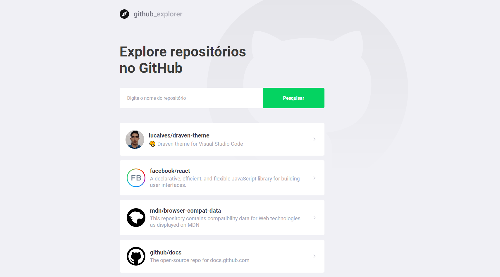

# Github Explorer

Github Explorer is a project developed during the course of Rocketseat.

## Screenshots



## Install

```bash
# Clone this repository
$ git clone git@github.com:lucalves/github-explorer.git

# Go into the repository
$ cd github-explorer

# Open the repository in the IDE (If you use VS Code)
$ code .

# Install dependencies
$ yarn or npm install

# Run!
$ yarn or npm start
```
